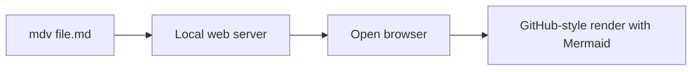
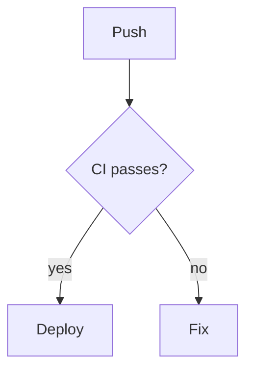

# mdv — Markdown Viewer

`mdv` is a small CLI tool that renders a local Markdown file in your browser,
as close as possible to the way GitHub renders it — including **Mermaid**
diagrams.



## Features

- **GitHub Flavored Markdown** — tables, task lists, strikethrough, autolinks,
  and more, rendered with the same CSS GitHub uses
  ([github-markdown-css](https://github.com/sindresorhus/github-markdown-css))
- **Mermaid diagram support** — ` ```mermaid ` code fences are rendered as
  diagrams, just like on GitHub (flowcharts, sequence diagrams, gantt
  charts, …)
- **Syntax highlighting** — code fences highlighted with
  [highlight.js](https://highlightjs.org/) using the `github` theme
- **Relative assets** — image links such as `` resolve against
  the markdown file's directory, mirroring GitHub repository-relative behavior
- **Zero-config** — picks a random free port (or use your own), then opens the
  page in your default browser via the `open` command

## Install

Requires Node.js 18+.

```sh
git clone <repo-url> mdv
cd mdv
npm install
npm run build
npm link        # optional: puts `mdv` on your PATH
```

## Usage

```sh
mdv <markdown-file> [port]
```

| Argument | Description |
| ------- | ---------- |
| `<markdown-file>` | Path to the markdown file to render |
| `[port]` | Optional port to listen on (default: random free port) |

Examples:

```sh
mdv README.md           # random port, opens browser
mdv docs/spec.md 8080   # specific port
node dist/index.js test.md   # without npm link
```

Starts a local web server on `127.0.0.1`, renders the file, and opens
`http://localhost:<port>/` in your browser. Press `Ctrl+C` to stop.

## Options

```
-h, --help    Show help
```

## What it looks like

Given this markdown:

````markdown
## Deployment


````

You get a GitHub-styled page with a rendered flowchart diagram.

## Development

```sh
npm install
npm run build              # compile TypeScript to dist/
node dist/index.js test.md # try it with the sample fixture
```

Layout:

```
src/
├── index.ts   # CLI entry point and HTTP server
├── render.ts  # markdown → GitHub-style HTML pipeline
└── util.ts    # helpers (HTML escaping)
```

Rendering assets (github-markdown-css, highlight.js, mermaid) are loaded from
CDNs at page load, so no bundling step is needed.

## License

MIT