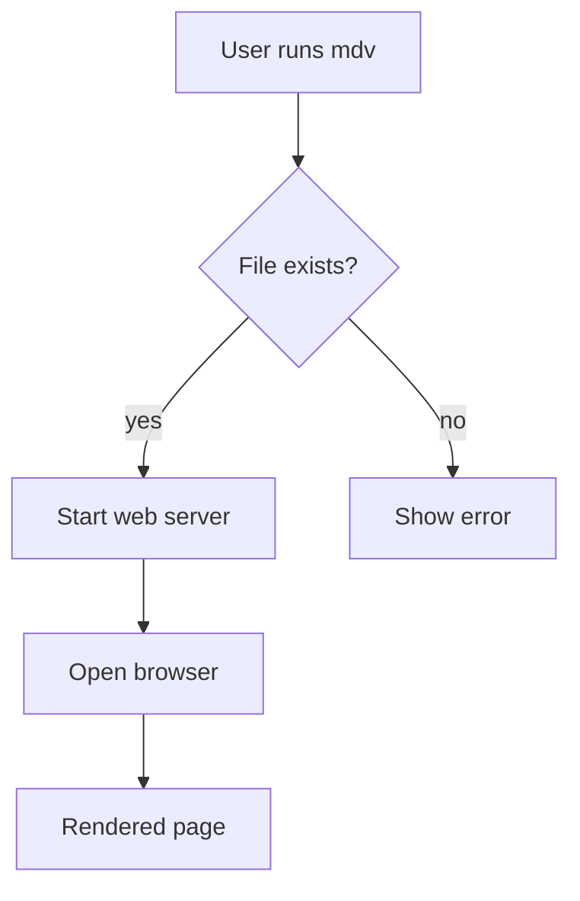
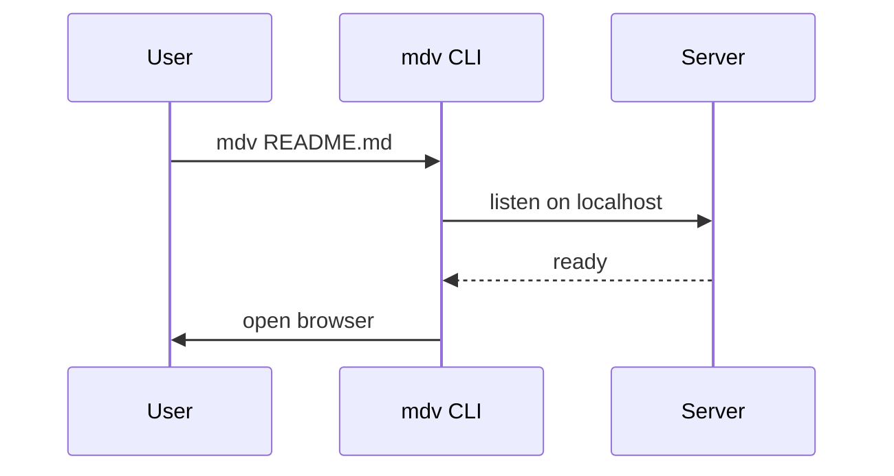

# Markdown Viewer Test

This is a **test** of the `mdv` viewer with _GitHub-flavored_ markdown.

## GFM Features

- [x] Task list item (checked)
- [ ] Task list item (unchecked)
- Tables and code fences

| Feature | Supported |
| ------- | --------- |
| GFM tables | ✅ |
| Strikethrough | ~~yes~~ |
| Autolinks | https://example.com |

## Code Block

```ts
const greeting: string = "Hello, world!";
console.log(greeting);
```

## Mermaid Diagram



## Sequence Diagram



> A blockquote, for good measure.

1. First
2. Second
3. Third